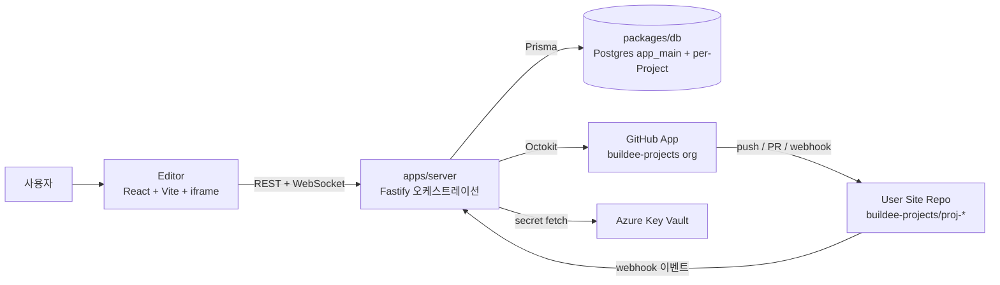

# Buildee

AI website builder for non-developers. Natural-language editing, automated maintenance.

이 레포는 **MVP 인프라 + 오케스트레이션 서버**의 모노레포. 사용자 사이트 코드는 별도 GitHub org(`buildee-projects`)의 private repo에 자동 생성됨.

## 통합 산출물

이 레포에 풀어 놓은 코드는 GitHub Issues 3개의 통합 산출물:

- **[Issue #1](https://github.com/bradyoo12/buildee/issues/1) [a-1]** Postgres + Prisma 데이터 레이어 → `packages/db/`
- **[Issue #2](https://github.com/bradyoo12/buildee/issues/2) [a-2]** Fastify 오케스트레이션 서버 → `apps/server/`, `infra/`, `.github/`
- **[Issue #3](https://github.com/bradyoo12/buildee/issues/3) [a-3]** GitHub App 통합 → `apps/server/src/lib/github-app.ts` 등 + 통합된 webhook handler

## 폴더 구조

```
buildee/
├── package.json                 # 모노레포 root (pnpm workspaces)
├── pnpm-workspace.yaml
├── .env.example
├── .gitignore
├── apps/
│   └── server/                  # Fastify 오케스트레이션 서버
│       ├── src/
│       │   ├── server.ts        # entry
│       │   ├── app.ts           # plugins + routes 등록
│       │   ├── lib/
│       │   │   ├── config.ts
│       │   │   ├── logger.ts
│       │   │   ├── key-vault.ts
│       │   │   └── github-app.ts
│       │   ├── plugins/
│       │   ├── routes/          # health, auth, projects, change-requests, tickets, forms, ws, webhook/github
│       │   ├── services/        # classification, fast-path, ticket-dispatcher, repo-manager, issue-builder, pr-manager, notification
│       │   └── workers-internal/
│       ├── templates/
│       │   └── CLAUDE.md.template
│       └── test/
├── packages/
│   └── db/                      # @buildee/db
│       ├── prisma/
│       │   ├── schema.prisma           # app_main
│       │   ├── project-schema.prisma   # 각 Project DB
│       │   └── proj-migrations/
│       └── src/
├── infra/
│   └── main.bicep               # Azure 한 방 프로비저닝
├── docs/
│   └── github-app-setup.md
└── .github/
    └── workflows/
        └── deploy-server.yml    # CI/CD
```

## 아키텍처 다이어그램

<!-- ticket: #4 -->

이 모노레포 안의 컴포넌트 + 외부(GitHub App, Azure, 사용자 사이트 repo, Editor) 관계:



흐름 요약:
- **Editor → server**: 사용자 자연어 요청을 REST로 전송, 진척은 WebSocket으로 수신
- **server → DB**: `app_main` (사용자/프로젝트 메타) + 프로젝트별 분리 DB (사용자 콘텐츠)
- **server ↔ GitHub App ↔ user repo**: 코드/콘텐츠 변경을 푸시 + PR로 격리, webhook으로 결과 회신
- **server → Key Vault**: GitHub App private key, DB 비밀번호 등 시크릿은 inline 금지

## 다음 단계

배포 절차: [`docs/deployment-runbook.md`](docs/deployment-runbook.md) 따라 진행.

## 주요 결정사항 요약

- **DB 레이아웃**: 단일 Postgres 서버 + Project별 분리 DB (option E)
- **워커 라우팅**: PC (Claude Code Max) → API (Anthropic) → Tier 3 (OpenAI/Gemini, opt-in)
- **변경 카테고리**: CONTENT/CONFIG (fast-path) / COMPOSITION / DESIGN_SYSTEM / CODE / FULL_STACK / FORM
- **가드레일**: Layer 1 (build), Layer 2 (lint), Layer 5 (domain rules) 구현; 3·4·6·7·8 skeleton
- **호스팅**: Azure App Service B1 + Postgres Flexible B1ms + Static Web Apps + Key Vault
- **Editor**: React + Vite + iframe, postMessage 기반 inline 편집
- **모바일**: PWA (MVP), native track GA 후 결정

## 라이선스

(추후 결정)
